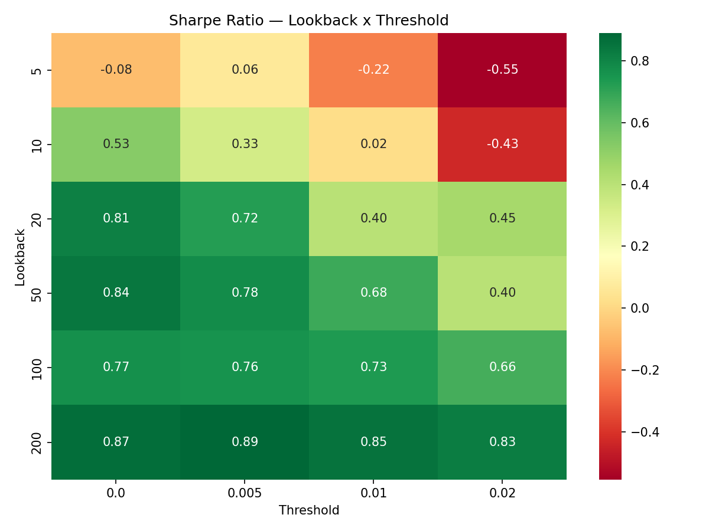

# Systematic Trading Research Backtester

A Python research project for designing, testing, and evaluating systematic momentum strategies on SPY market data.

This project was built as part of a quant trading / systematic research portfolio. It demonstrates a full research workflow: data ingestion, signal generation, cost-aware backtesting, performance evaluation, trade-level analysis, and parameter experimentation.

## What the project does

The system currently:

- downloads historical SPY OHLCV data using `yfinance`
- generates momentum-based trading signals
- applies a cost-aware backtest with transaction costs
- builds an equity curve and saves it as a plot
- calculates core performance statistics
- exports a trade log for trade-level review
- runs parameter sweeps across multiple lookback settings

## Current features

- Yahoo Finance OHLCV data loader
- Momentum strategy with configurable lookback and threshold
- Cost-aware backtesting engine
- Equity curve plot export
- Performance metrics:
  - Total Return
  - CAGR
  - Sharpe Ratio
  - Max Drawdown
- Trade log with:
  - entry date
  - exit date
  - holding period
  - trade return
- Parameter sweep for comparing multiple strategy configurations
- Export of research outputs to CSV / PNG files

## Current outputs

Example outputs generated by the project:

- `equity_spy_mom.png` — equity curve plot
- `trade_log_spy_mom.csv` — trade-level log
- `sweep_results.csv` — parameter sweep results

## Project structure

```text
trading_system/
│
├── src/
│   ├── data/
│   │   └── loader.py
│   │
│   ├── strategy/
│   │   └── momentum.py
│   │
│   ├── backtest/
│   │   └── engine.py
│   │
│   └── reporting/
│       ├── metrics.py
│       ├── plots.py
│       ├── trades.py
│       └── sweep.py
│
├── main.py
├── requirements.txt
└── README.md
```

## How to run
 ### 1. Create and activate a virtual environment

Mac / Linux:

```bash
python3 -m venv .venv
source .venv/bin/activate
```

Windows:

python -m venv .venv
.venv\Scripts\activate
2. Install dependencies
```bash
pip install -r requirements.txt
```
3. Run the project
```bash
python main.py
```
Example research workflow

## A typical workflow in this project is:

1. load SPY data
2. choose strategy parameters such as lookback and threshold
3. generate signals
4. run the backtest with costs
5. review metrics and equity curve
6. inspect the trade log
7. compare multiple parameter settings

## Why this project matters

This project is meant to show practical understanding of the research process behind systematic trading strategies, including:

turning a trading idea into rules

testing the idea on historical data

accounting for transaction costs

evaluating results with standard performance metrics

reviewing trades at the individual trade level

comparing parameter choices systematically

## Limitations

This is a research prototype, not a production trading system.

## Current limitations include:

single instrument only

based on Yahoo Finance data

simple momentum logic

no portfolio construction

no walk-forward validation

no regime filter or volatility targeting yet

## Next steps

Planned improvements:

grid search across lookback × threshold

SMA200 regime filter

volatility targeting

stronger validation and robustness checks

## Tech stack

- Python
- pandas
- numpy
- matplotlib
- yfinance

## Author

Built as a personal quant / systematic trading research project.

## Parameter Sweep Results

The momentum strategy was evaluated across multiple parameter combinations.

Tested parameters:
- lookback: 5, 10, 20, 50, 100, 200
- threshold: 0.0, 0.005, 0.01, 0.02

Results were ranked by Sharpe Ratio.

### Sharpe Ratio Heatmap



The heatmap shows the Sharpe Ratio across parameter combinations.

Initial testing suggests the strongest configuration was approximately:

- lookback = 200
- threshold = 0.005